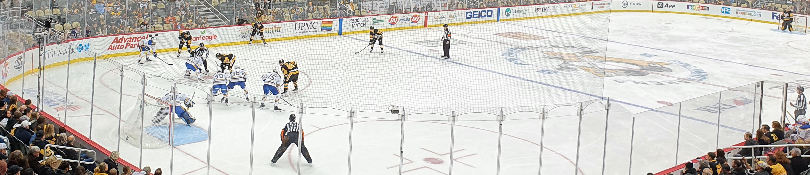
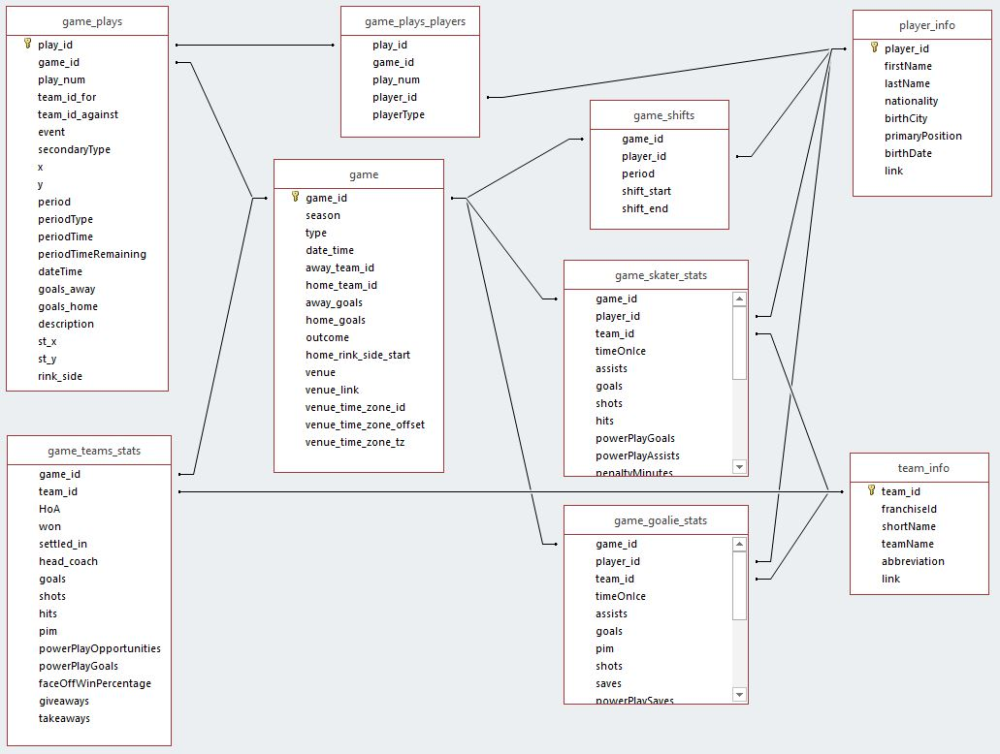
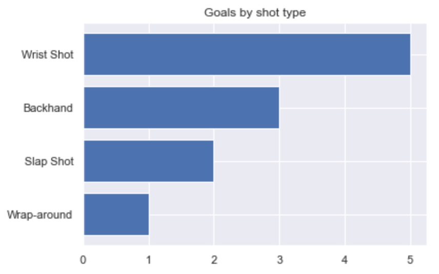
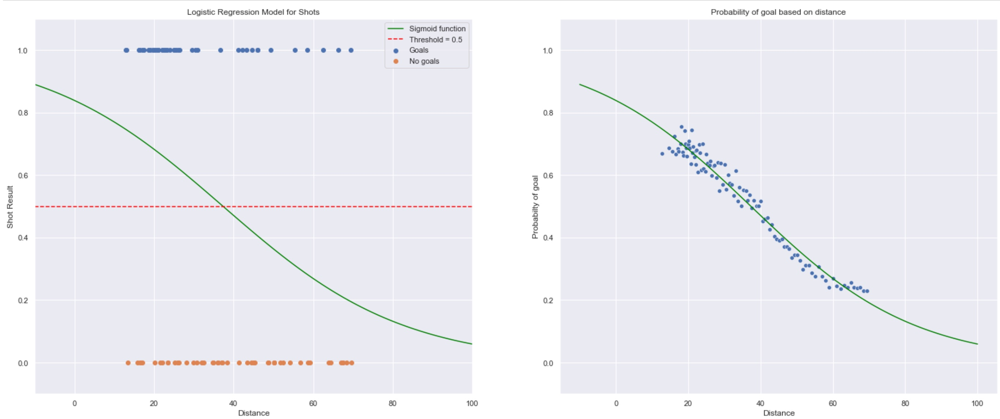
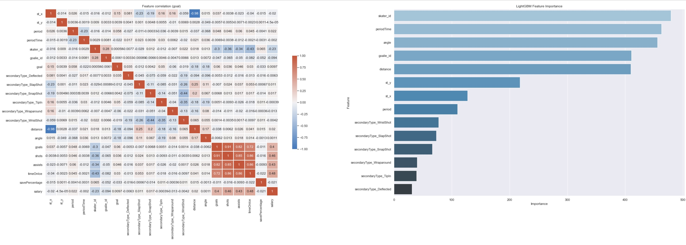

<p align="center">
  <a href="data/images/nhl_img.jpg">
    
  </a>
</p>

<hr style="border:1px solid gray"> </hr>


<a name="title"></a>
## **Goal or No Goal?**

- [Project Motivation](#motivation)
- [Installation](#installation)
- [Datasets](#datasets)
- [File Descriptions](#files)
- [How to use the project](#usage)
- [Authors, Licensing, Acknowledgments](#authors)

<hr style="border:1px solid gray"> </hr>

<a name="motivation"></a>
## *Project Motivation*

Hockey is an amazing game. There are several datasets providing very detailed information on  players and games. You can find very impressive statistics for particular players, explore their salary, get detailed event recordings for many games. This project is providing data analysis based on those datasets. I partular, the goals of the project are:

- Exloring and joining data from multiple sources and datasets. 
- Extracting interesting facts, visualizing data in different plots, exploring data needed for later prediction.
- **Predicting probability of a goal based on shot circumstances.** 
- Select and define proper metrics to evaluate the predicting model.
- Improve model according to selected metrics.

In order to achieve those goals, three dataset from two different sources have been used:

- [NHL Player Salaries](https://www.kaggle.com/camnugent/predict-nhl-player-salaries) (player statistics, incl. salaries)
- [NHL Game Data](https://www.kaggle.com/martinellis/nhl-game-data) (Game, team, player and plays information including x,y coordinates)
- [World Cities](https://simplemaps.com/data/world-cities) (GPS coordinates for world cities)

<br>

To read more, see my Medium blog article:
["Goal or No Goal?"](https://rmnng.medium.com/goal-or-no-goal-a-goal-scoring-prediction-for-shots-in-hockey-6d0e3cf7e6ca)
<br>
<br>
<a name="installation"></a>
## *Installation*
To open and execute all jupyter notebook in this project, install the newest [Anaconda distribution](https://docs.anaconda.com/anaconda/install/). Following python libraries have been used:
- *pandas (1.2.4)*
- *numpy (1.20.1)*
- *maplotlib (3.3.4)*
- *folium (0.12.1)*
- *seaborn (0.11.1)*
- *sklearn (0.24.1)*
- *lightGBM (3.2.1)*. 

In case you are missing any of the libs after you installed Anaconda, use following syntax on the command line to install:
 
 ```
pip3 install <name_of_the_lib> 
```
Python version used for the development was *Python 3.8*. 
<br>

<a name="datasets"></a>
## *Datasets*
It was not possible to push all data files to GitHub due to a large size. If some of the data is missing and in order to re-execute the project, please download dataset into following folders:

- [NHL Player Salaries](https://www.kaggle.com/camnugent/predict-nhl-player-salaries) to folder [data/nhl/nhl_salaries/](data/nhl/nhl_salaries/)
- [NHL Game Data](https://www.kaggle.com/martinellis/nhl-game-data) for folder [data/nhl/nhl_stats/](data/nhl/nhl_stats/)
- Download file [simplemaps_worldcities_basicv1.74.zip](https://simplemaps.com/static/data/world-cities/basic/simplemaps_worldcities_basicv1.74.zip) and unpack it in folder [data/cities/](data/cities/)

<br>

<a name="files"></a>
## *File Descriptions*
The core of the project are five jupyter notebooks (ordered by name) and the file *utils.py* providing reusable code. The best way to start is to open and review one jupyter notebook after another (starting with **#1**, finishing with **#5**). The particular notebooks provide following content:
<br>
<br>

[**1_nhl_explore_players.ipynb**](1_nhl_explore_players.ipynb) - provides interesting insight about NHL players, their salary, place of birth and answering the question where the major part of players was born.


[**2_nhl_explore_games.ipynb**](2_nhl_explore_games.ipynb) - exploring divers statistics of events happened during multiple games, like e.g. shots on goal, goals.



[**3_nhl_explore_one_game.ipynb**](3_nhl_explore_one_game.ipynb) - exploring statistics for one particular game and starting to evaluate possible predictive features.



[**4_nhl_goal_prediction.ipynb**](4_nhl_goal_prediction.ipynb) - goal prediction using first binary classifier, explaining of metrics, evaluation and vizualization of the performance, classifier selection.



[**5_nhl_next_improvements.ipynb**](5_nhl_next_improvements.ipynb) - model improvements, feature engineering, feature importance, model finetuning



[**utils.py**](utils.py) - useful re-usable functions for data manipulation, visualization and training. 


<br>
<br>


<a name="usage"></a>
## *How to use the project* 
If you want to re-run all jupyter notebooks in this project, the best way is to create a folder on your local PC and clone the project using:
 ```
git clone https://github.com/rmnng/dsnanocapstone.git 
```
Download datasets following steps described in the section [Datasets](#datasets).
<br>

<a name="authors"></a>
## *Authors, Licensing, Acknowledgments*
Author: Roman Nagy
<br>
License: See [license file](LICENSE)
<br>
<br>
Acknowledgment: 
- Thanks Kaggle contributors for provided datasets:
    - [NHL Player Salaries](https://www.kaggle.com/camnugent/predict-nhl-player-salaries)
    - [NHL Game Data](https://www.kaggle.com/martinellis/nhl-game-data)
- Thanks [World Cities](https://simplemaps.com/data/world-cities) for cities and GPS dataset.
- Thanks [Udacity](https://www.udacity.com/) for the inspiration.
